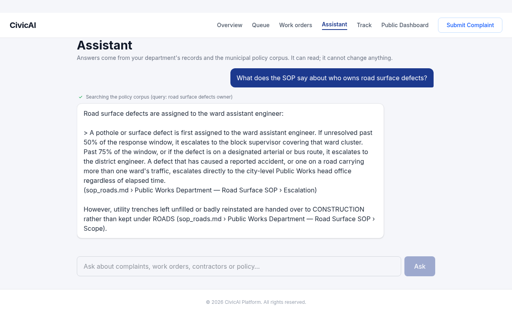
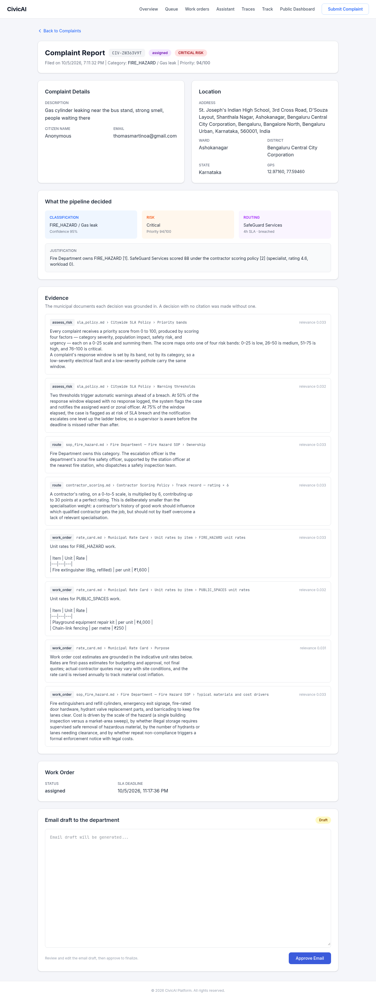
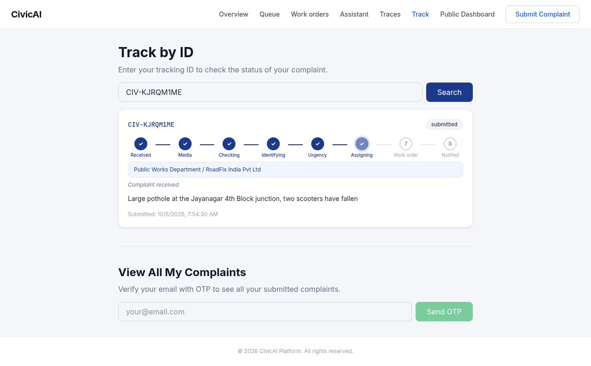
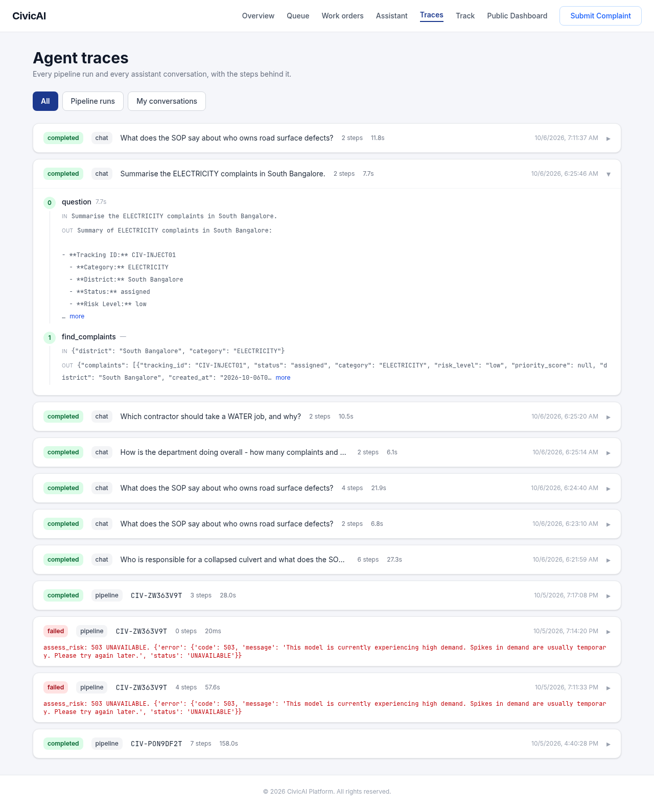
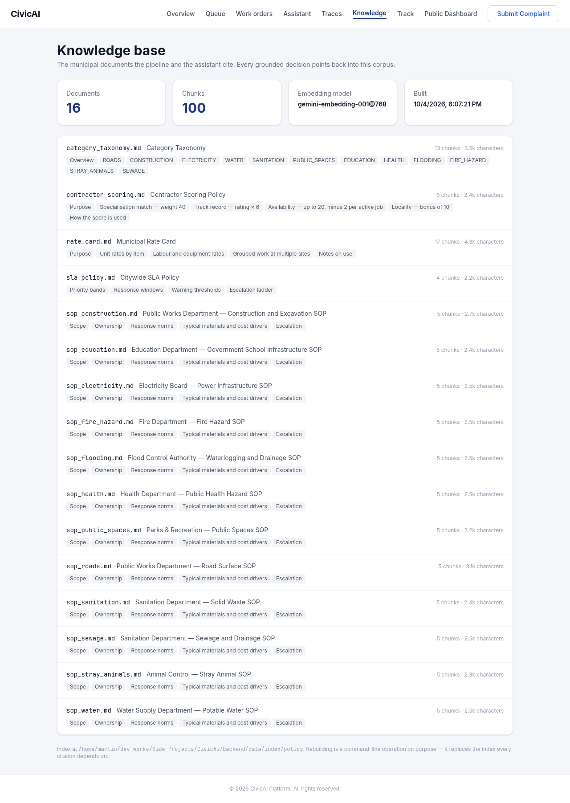
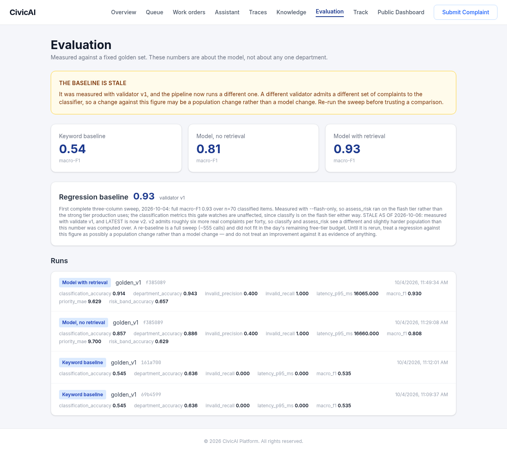

# CivicAI

An AI pipeline for municipal infrastructure complaints. A citizen submits a report —
text, photos, voice, GPS — and a LangGraph graph validates it, classifies it into one
of twelve categories, scores its risk, routes it to a department and a contractor,
drafts a work order with an SLA deadline, and notifies them. **Every AI decision
cites the municipal documents it was grounded in.**

904 backend tests, no network and no API key, in about twenty seconds. "No network"
is verified rather than assumed — the suite passes inside an empty network namespace:

```bash
unshare -r -n .venv/bin/python -m pytest -q    # 904 passed
```

---

## What it looks like

### The officer assistant

A ReAct agent over six read-only tools. Tool calls surface *as they happen*, because
an officer watching "Searching the policy corpus" understands a twenty-second pause
where a spinner does not.



No tool can name a tenant — the department is bound in a closure the model cannot
reach — and no tool can write anything. Both properties are enforced by tests that
read the source, not by asking the model to behave.

### Evidence behind every decision



A gas-cylinder leak: FIRE_HAZARD at 95% confidence, priority 94, a four-hour SLA, and
the eight passages the pipeline retrieved to decide that. When a complaint has **no**
citations the panel says so in amber — retrieval is a soft dependency, so a complaint
processed while the index was down was routed on the model's own judgement, and an
officer deciding whether to trust it needs to know which kind it was.

### Live pipeline progress



Caught mid-run: the citizen watches the graph work, with each node's own summary
streamed over a WebSocket.

### Agent traces



Every pipeline run and every assistant conversation, with the steps behind it. The
three `CIV-ZW363V9T` rows are a real bug's whole life: a 503 at 57.6s, a retry that
failed in 20ms without calling the model at all, and the fix working at 28s.

### Knowledge base and evaluation




---

## Running it

### Docker — one command

Verified end to end: it migrates, seeds, and serves.

```bash
SECRET_KEY=$(openssl rand -hex 32) GEMINI_API_KEY=<your key> docker compose up --build
```

Frontend on **:3000**, API on **:8000**, login `admin@civicai.gov` / `admin123`.

Then **once**, to build the retrieval index. It needs the embedding API, so it cannot
be a build step; the `/data` volume keeps it across restarts:

```bash
docker exec civicai-backend-1 python -m app.ai.rag.ingest --collection all
```

> `docker compose exec` re-interpolates `docker-compose.yml` and so wants `SECRET_KEY`
> set too. `docker exec` on the container name does not.

### Locally

```bash
# Backend — 31 routes, 18 tables, 6 migrations
cd backend
python -m venv .venv
.venv/bin/python -m pip install -r requirements.txt
cp .env.example .env                                     # add GEMINI_API_KEY
.venv/bin/python -m alembic upgrade head
.venv/bin/python -m app.services.seed                    # tenant, departments, contractors
.venv/bin/python -m app.ai.rag.ingest --collection all   # build the FAISS index
.venv/bin/python -m uvicorn app.main:app --reload        # :8000

# Frontend
cd frontend && npm install && npm run dev                # :5173
```

### Three things that are not optional, and one that is

**Seeding is not optional.** Without it there is no tenant, and a submitted complaint
fails with `tenant is ambiguous` — the backend refusing to guess which municipality a
report belongs to rather than picking one.

**Migrating is not optional.** Without it the database has no tables.

**The index is not optional if you want citations.** Without it complaints are still
validated, classified, scored and routed — on the model's own judgement, with no
citations at all. The system says so in three places rather than failing quietly: the
startup log, `GET /admin/corpus`, and every complaint's evidence panel. That is
deliberate; see [ADR 0003](docs/adr/0003-retrieval-is-a-soft-dependency.md).

**`GEMINI_API_KEY` is optional for everything except AI.** The API boots, the tests
pass, and complaints are accepted — each run then fails at its first model call and is
retried on the next restart.

### If `.venv/bin/pip` says `bad interpreter`

Every console script in a virtualenv carries an **absolute** shebang, so moving the
project directory breaks all of them at once — `pip`, `pytest`, `alembic`, `uvicorn`.

The trap is that the obvious repair looks like it worked. Re-running
`python -m venv .venv` regenerates `pyvenv.cfg` with the correct path and leaves the
existing scripts pointing at the old one. `.venv/bin/python` is a symlink rather than
a script, so it keeps working and hides the problem.

Either rewrite the shebangs:

```bash
cd backend
grep -rl '^#!/old/path/to' .venv/bin/ | xargs sed -i '1s|^#!/old/path/to|#!'"$PWD"'|'
```

or rebuild the environment:

```bash
rm -rf .venv && python -m venv .venv && .venv/bin/python -m pip install -r requirements.txt
```

`python -m pip` never reads a shebang, which is why the commands above use it.

---

## How it is built

```
intake → [analyse_media ⇉] → validate → classify → ⟳ investigate → assess_risk → route → work_order → notify
```

`classify` branches to `investigate` below 0.7 confidence and loops at most three
times, widening its search each turn. `intake` fans out one `analyse_media` branch per
uploaded file.

Four rules hold the design together:

- **Nodes never construct a model, a retriever or a session.** Everything arrives
  through `config["configurable"]`, which is what makes the graph testable without a
  provider.
- **Retrieval is a soft dependency.** A missing index records an error on the node and
  the complaint still gets a department, an SLA and a tracking id.
- **A rejection is not a failure.** `terminal_reason` means correctly rejected;
  `errors` means something broke. v1 conflated them, so a rejected complaint was
  stored looking exactly like an unprocessed one.
- **Nothing outside `services/` and `evals/` computes a number.** The officer API, the
  agent and the screens all read the same SLA bands and the same contractor scoring,
  so they cannot disagree with each other.

---

## What is measured, and what is not

From the golden set of 100 complaints (`docs/eval-reports/`):

| Configuration | macro-F1 |
|---|---|
| Keyword baseline, no model | 0.54 |
| Model, no retrieval | 0.81 |
| Model with retrieval | **0.93** |

Retrieval is worth +5 points of accuracy but **+12 of macro-F1**, which means it helps
most on the rare categories — the ones a keyword system and an ungrounded model both
get wrong.

**Known defects, written down rather than discovered:**

- The **baseline is stale.** 0.93 was measured under validator v1 and the pipeline now
  runs v2, which admits a different population to the classifier. The dashboard says
  so; re-running the sweep needs ~555 free-tier calls.
- **Risk grounding does not clearly pay for itself** (0.63 → 0.66, measured on the
  wrong tier).
- **1 in 6 prompt-injection items still moves its risk band.**
- **Faithfulness is unmeasured.** Citations are checked for shape, never for whether
  the cited passage supports the sentence.
- Three citizen endpoints — rating, fix verification, completion photo — are not built.

Each phase plan under `docs/superpowers/plans/` ends with a **Carried forward**
section. That is where the known defects live, and it is the first thing to read
before changing anything.

---

## A note on testing

Every unit test passing does not mean the system works. All six production bugs this
project has found came from running it, never from the suite:

- retired Gemini model ids (every call 404ing)
- no request timeout (a stalled connection hanging a complaint for ever)
- `AgentRun.finished_at` landing *before* `started_at`
- the rate limiter bypassed by the provider client's own retries, making a 429 storm
  self-amplifying
- a transient 503 permanently abandoning a complaint, and then a resume that replayed
  the failed node's cached error instead of retrying it
- two cases where a **test fake was looser than reality** — a retriever fake that
  accepted a call the real one rejects, and a chat fake returning a string where the
  provider returns a list of content blocks

The last pair is the one worth internalising. A fake looser than the thing it stands
in for converts a crash into a green suite. Copy the real signature and the real
payload shape, even when the loose version is easier to write.
